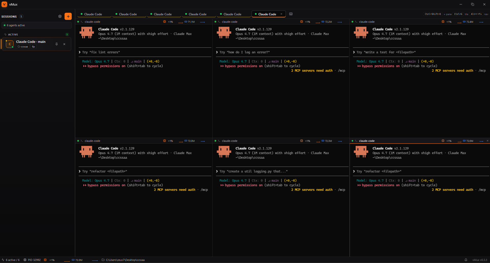
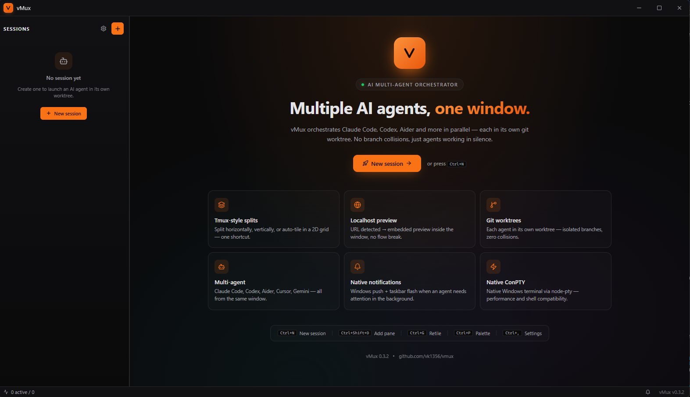
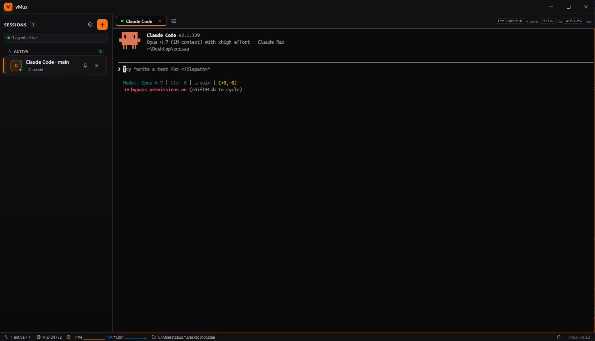

<div align="center">



# vMux

### Run a whole **team of AI coding agents** at once — natively on Windows.

**vMux** is the Windows-native [cmux](https://github.com/manaflow-ai/cmux) alternative.
Spin up Claude Code, Codex, Aider, Cursor Agent and Gemini **side by side** — each fenced in its **own git worktree**, in tmux-style splits, on real **ConPTY** terminals, with an embedded localhost preview and automatic event detection.

**No WSL. No Docker. No browser tab. No prefix keys.** Just one fast desktop app that actually understands ConPTY.

[](https://github.com/vk1356/vmux/releases/latest)
[](https://github.com/vk1356/vmux/releases)
[](https://github.com/vk1356/vmux/stargazers)
[](#license)
[](#requirements)
[](https://www.electronjs.org/)

[**⬇ Download**](https://github.com/vk1356/vmux/releases/latest) ·
[Why](#why-vmux) ·
[Features](#features) ·
[vs cmux](#vmux-vs-cmux) ·
[Under the hood](#under-the-hood) ·
[Quick start](#installation) ·
[Architecture](#architecture)

</div>

---

## ⚡ In 30 seconds

- 🧑‍💻 **Many agents, one window** — 6 preset agents (Claude Code · Codex · Aider · Cursor Agent · Gemini) + raw shell, each in its **own git worktree** so they never collide on the same branch.
- 🪟 **tmux-style splits that auto-tile** — `Ctrl+Shift+D` to add a pane and rebalance into a 2D grid. Navigate with `Alt+arrows`. No `.tmux.conf`, no prefix key.
- 🖥️ **Real Windows terminals** — `node-pty` + **ConPTY**, GPU-accelerated `xterm.js` (WebGL), Unicode 11, bracketed paste — not a WSL shim.
- 🌐 **Embedded localhost preview** — vMux watches each pane's output, auto-detects `localhost:PORT`, and opens it in an in-app browser **with a built-in DevTools console**.
- 🔔 **Knows when an agent needs you** — detects `server-ready` / `build` / `test` / `agent-done`, fires native **Windows toasts + taskbar flash**, and badges the sidebar.
- 🤖 **Built for agents** — image-paste → temp PNG path, an opt-in **Chrome DevTools Protocol bridge** for `chrome-devtools-mcp`, and an auto-installed `/vmux:orchestrate` slash command for Claude Code.
- 🚀 **Ships like a product** — one-click NSIS installer, **differential auto-update** (downloads only changed bytes), 7-language UI, `Ctrl+K` command palette, live CPU/RAM per pane.

<div align="center">

<sub><i>The home screen — spin up your first agent in two clicks, drag-drop a folder, or launch from the CLI.</i></sub>
</div>

---

## Why vMux?

Modern AI coding agents are powerful but **hard to orchestrate**: each one wants its own terminal, its own working directory, its own branch. Running three of them in parallel without stepping on each other's toes means juggling worktrees, tmux panes, browser tabs and notifications.

On macOS, [cmux](https://github.com/manaflow-ai/cmux) already solved this elegantly. On Windows, the options were grim:

- **WSL2** → slow cross-OS file I/O, clipboard quirks, a second filesystem to reason about.
- **Docker** → overkill for "I just want three terminals".
- **Roll your own tmux** → good luck with ConPTY edge cases, resize storms and TUI repaint bugs.

**vMux solves it in one native Windows window.** Spawn as many agent sessions as you want, each fenced inside its own git worktree, with splits that auto-tile, an embedded browser for your dev server, and Windows-native notifications when an agent needs your attention.

<div align="center">

<sub><i>Anatomy of a session: grouped sidebar, per-pane tabs, and a live status bar (PID · CPU% · memory · cwd).</i></sub>
</div>

---

## vMux vs cmux

[cmux](https://github.com/manaflow-ai/cmux) nailed multi-agent orchestration on macOS. vMux brings the same idea — natively — to Windows. Here's how they compare.

| | **vMux** | cmux |
|---|---|---|
| **Platform** | Windows 10/11 native | macOS only |
| **Stack** | Electron 42 + React 19 + TypeScript 6 | Swift / AppKit + libghostty |
| **Terminal backend** | node-pty + **ConPTY** | libghostty |
| **Install** | NSIS installer, one click | DMG / brew |
| **Auto-update** | ✅ differential blockmap (~few MB) | manual / brew |
| **Multi-agent presets** | 6 built-in + custom overrides | works with any CLI |
| **Git worktree isolation** | ✅ per-session | ✅ per-workspace |
| **Tmux-style splits + auto-tile** | ✅ 2D / even-h / even-v / main-stack | ✅ |
| **Embedded localhost preview** | ✅ webview + built-in DevTools console | ✅ scriptable browser |
| **Chrome DevTools Protocol bridge** | ✅ opt-in for `chrome-devtools-mcp` | ✅ CDP proxy |
| **Image clipboard paste** | ✅ Ctrl+V on screenshot → temp PNG path injected | ✅ |
| **Claude Code slash command** | ✅ `/vmux:orchestrate` auto-installed | ✅ |
| **Event detection** | server-ready / build / test / agent-done | OSC 9/99/777 |
| **Native OS notifications** | Windows toast + taskbar flash + custom sound | macOS Notification Center |
| **Sync-input broadcast** | ✅ `Ctrl+Shift+S` | ❌ |
| **Command palette** | ✅ `Ctrl+K` fuzzy search | ❌ |
| **i18n** | 🇬🇧🇫🇷🇩🇪🇪🇸🇨🇳🇯🇵🇹🇷 **7 languages** | English only |
| **Live CPU/RAM per pane** | ✅ pidusage | ❌ |
| **CLI launcher** | `vmux new --agent claude-code --prompt "..."` | `cmux` |
| **License** | MIT | MIT |

**TL;DR** — on **macOS** use cmux, it's the original and excellent. On **Windows**, vMux is the equivalent native experience: no WSL, no Docker, no browser tab, just a desktop app that knows ConPTY.

vMux is **not** a port of cmux — it's a from-scratch, Windows-first redesign with different defaults (Electron + React, built-in DevTools console, 7-language UI, differential auto-update). The two tools share a philosophy, not a codebase.

---

## Features

### 🧑‍💻 Multi-agent orchestration
- **6 preset agents**: Claude Code, Codex, Aider, Cursor Agent, Gemini, raw shell.
- **Isolated sessions** — each agent runs inside its own dedicated git worktree, no branch collisions; ephemeral worktrees are cleaned up on close.
- **PATH detection** with availability checking + install hints when an agent isn't found.
- **Per-agent overrides** — remap command/args/env from Settings without touching code.
- **`/vmux:orchestrate` Claude Code slash command** auto-installed in `~/.claude/commands/vmux/` — decomposes a task into independent units and spawns one Claude Code pane per unit via the vMux CLI.

### 🤖 Native AI-agent integrations
- **Chrome DevTools Protocol bridge** *(opt-in)* — enable it in **Settings → Advanced** to expose CDP on `localhost:9222` so `chrome-devtools-mcp` (or any DevTools-aware tool) can drive the embedded `<webview>` preview: click, type, snapshot the accessibility tree, evaluate JS. **Off by default** — an open debug port lets any local process run code in the renderer, so it's strictly opt-in.
- **Image paste (Ctrl+V on a screenshot)** — the clipboard image is auto-saved to a temp PNG and its absolute path is pasted into the terminal. Kills the "screenshot → save → drag" dance for Claude/Codex vision prompts.
- Toggled from Settings (`cdpEnabled`, `claudeCommandsEnabled`).

### 🪟 Tmux-style splits + auto-tile
- `Ctrl+Shift+D` — add a pane → auto-tile in a balanced 2D grid.
- `Ctrl+Shift+E` — manual vertical split.
- `Ctrl+G` — re-tile current session · `Ctrl+Shift+W` — close focused pane (session stays alive).
- `Alt+←/→/↑/↓` — navigate between panes.
- **Layout presets**: tiled (2D), even-horizontal, even-vertical, main+stack. Drag separators to resize live.

### 🌐 Embedded localhost preview
- **Auto-detection** of `localhost:XXXX`, `127.0.0.1:XXXX`, etc. from each pane's output (ANSI / box-drawing stripped).
- Embedded `<webview>` opens automatically when a URL is detected; toolbar with back / forward / reload / address bar / open-external.
- **Built-in DevTools console** with level filters (errors / warnings / logs), live capture, an error peek-banner, and a 500-entry FIFO buffer.
- Persistent URL chips in the tab bar to re-open any detected URL.

### 🔔 Event detection + native notifications
- Patterns detected: `server-ready`, `build-success`, `build-error`, `test-results`, `agent-done`.
- In-app toast with a colored badge per kind.
- **Native Windows notifications** (with the vMux icon) when the app is in the background, plus **taskbar flash** when an agent needs an action, and a **configurable custom sound**.
- Sidebar badges per session: 🚀 ready / ✓ build / ✗ error / 🌐 URL.

### 🚀 Auto-update from GitHub Releases
- Checks on launch and every 4 hours (8s hard timeout — never hangs the UI).
- **Differential download via blockmap** — only the changed bytes (~few MB instead of 100 MB).
- One-click in-app install: download → silent install → app restarts itself; manual fallback via integrated download (no browser opened).

### 🌍 Internationalization (7 languages)
🇬🇧 English (default) · 🇫🇷 Français · 🇩🇪 Deutsch · 🇪🇸 Español · 🇨🇳 中文 · 🇯🇵 日本語 · 🇹🇷 Türkçe — switch live from **Settings → Appearance → Language**, with English fallback for missing keys.

### ⌨️ CLI: launch sessions from any terminal
The NSIS installer adds vMux to your `PATH` automatically:

```bash
vmux                                              # focus the running window
vmux new --agent claude-code --prompt "fix bug"   # spawn a new session
vmux new -a codex -d "C:\repos\my-app" -p "tests"
vmux help                                         # full reference
```

### ✨ Pro features
- **Command palette** `Ctrl+K` — fuzzy search over sessions, panes, actions, URLs, agents.
- **Sync input** `Ctrl+Shift+S` — broadcast keystrokes to every terminal in the session (red border while active).
- **Drag & drop** a folder onto the window → opens the new-session dialog with the cwd pre-filled.
- **Live process monitoring** — CPU % and memory (MB) per pane, plus PID, in the status bar.
- **Session rename** (double-click) and **pane rename** (right-click → Rename).
- **Pinning + grouping** — sessions auto-group into Pinned / Active / Idle in the sidebar.
- **Restart all idle panes** in a session in one click · custom session colors · sidebar filter.
- **Per-pane ErrorBoundary** — a crashed pane never takes down the whole app.
- **Crash recovery** (graceful-shutdown flag) · **single-instance lock** (second `vmux.exe` focuses the running window).
- **Persistence** — sessions, layouts, window position and sidebar width survive restarts (cap 100 sessions).

### 🖥️ Terminal (xterm.js)
WebGL renderer by default · `Ctrl+Shift+F` in-pane search · Unicode 11 (full emoji) · copy-on-selection + paste-on-right-click · ConPTY via `node-pty` · bracketed-paste preserved.

---

## Under the hood

vMux isn't a thin wrapper around a terminal — the engineering is built for running *many* noisy agents at once without jank.

- **PTY process isolation** — all PTYs and output analysis live in a dedicated Electron **`utilityProcess` ("PTY host")**, supervised by the main process over RPC. If node-pty ever crashes, the host **respawns automatically** and the UI keeps running (in-flight calls are rejected cleanly, channels rebuilt).
- **60 Hz output coalescing + adaptive flush** — agent spew is batched once per frame, but a small keystroke after a quiet moment is flushed **synchronously** so typing still feels instant. Output bytes travel host → renderer over a per-window `MessagePort`, keeping the main thread off the hot path.
- **Bounded WebGL renderer pool** — GPU contexts are pooled and released for off-screen panes, so opening a dozen terminals never triggers the browser's "too many WebGL contexts" cascade. Off-screen panes drop to a cheaper renderer and trim scrollback.
- **Hardened by default** — `contextIsolation` on, `nodeIntegration` off, sandboxed `<webview>`s, a strict CSP in production, every IPC message origin- and shape-validated, `git` invoked via `execFile` (never a shell), and the CDP debug port **off unless you opt in**.
- **Tested & typed** — **270+ unit tests** (tree, layouts, detectors, IPC validation, PTY-host protocol, store, i18n) plus full `tsc` strict typecheck and a **zero-warning** ESLint gate.

---

## Stack

| Layer | Tech |
|---|---|
| Shell | Electron 42 (Chromium + Node 22) |
| UI | React 19 + TypeScript 6 |
| Bundler | electron-vite 6 + Vite 8 (rolldown, instant HMR) |
| PTY | node-pty 1.1 + ConPTY (Windows native), in an isolated `utilityProcess` |
| Terminal | xterm.js 6 + addons (fit / web-links / search / unicode11 / webgl / clipboard / ligatures) |
| State | Zustand 5 |
| Persistence | electron-conf (schema + migrations) |
| Auto-update | electron-updater 6 + GitHub API fallback |
| Process monitoring | pidusage + pidtree |
| Logs | electron-log (`%APPDATA%\vMux\logs\`) |
| Icons | lucide-react |
| Tests | Vitest 4 — 270+ tests |

---

## Requirements

- **Windows 10** (build 1809+) or **Windows 11**
- **Git** in PATH (worktree management)
- **PowerShell 7** recommended (Windows PowerShell 5.1 also works)
- At least one agent installed in PATH for productive use (`claude`, `codex`, `aider`, `cursor-agent`, `gemini`)
- **Node.js 22 LTS** — *for development only*

---

## Installation

### For end-users

Download the latest installer from [**Releases**](https://github.com/vk1356/vmux/releases/latest):

- **`vMux-Setup-x.y.z-x64.exe`** — NSIS installer (desktop & start-menu shortcuts, adds `vmux` to PATH, enables auto-update).
- **`vMux-Portable-x.y.z-x64.exe`** — standalone executable, no install required.

After install, every future update happens in-app automatically: **Settings → Updates → Check now → Download → Install and restart**.

### For developers

```bash
git clone https://github.com/vk1356/vmux.git
cd vmux
npm install
npm run dev    # opens with HMR (renderer on port 5183)
```

> If `node-pty` fails to compile (Python 3.12 distutils issue), the `node-gyp` override in `package.json` handles it. **No Python build tools required** — the prebuilt NAPI binary works with Electron.

---

## Scripts

```bash
npm run dev          # dev server with HMR
npm run build        # bundle out/
npm run package      # NSIS installer + portable in release/
npm run release      # build + publish to GitHub Releases (needs GH_TOKEN)
npm run typecheck    # tsc --noEmit on node + web projects
npm run lint         # eslint + typecheck
npm run test         # vitest run (270+ tests)
npm run icon         # regenerate build/icon.ico from build/icon.svg
```

---

## Keyboard shortcuts

| Shortcut | Action | | Shortcut | Action |
|---|---|---|---|---|
| `Ctrl+N` | New session | | `Ctrl+Shift+D` | Add a pane (auto-tile) |
| `Ctrl+K` | Command palette | | `Ctrl+Shift+E` | Manual vertical split |
| `Ctrl+,` | Settings | | `Ctrl+Shift+W` | Close focused pane |
| `Ctrl+W` | Close active session | | `Ctrl+G` | Re-tile session |
| `Ctrl+B` | Toggle sidebar | | `Ctrl+Shift+S` | Toggle sync-input |
| `Ctrl+1..9` | Switch to Nth session | | `Ctrl+Shift+F` | Search inside terminal |
| `Alt+←/→/↑/↓` | Navigate between panes | | `Esc` | Close dialog / palette |

---

## Architecture

vMux runs as **three coordinated processes**: the Electron **main** process (windows, IPC, lifecycle), an isolated **PTY-host `utilityProcess`** (owns every node-pty + all output analysis, so a PTY crash can't take down the UI), and the **renderer** (React UI). PTY output bytes flow host → renderer over a per-window `MessagePort`, bypassing the main thread.

```
src/
├── main/                          # Electron main process (Node)
│   ├── index.ts                   # Lifecycle, single-instance, security hardening, CLI dispatch
│   ├── window.ts                  # Frameless windows + shared hardened webPreferences
│   ├── ipc.ts · ipc-validation.ts # Typed IPC channels + strict boundary validation
│   ├── pty-host-supervisor.ts     # Forks & respawns the PTY-host utilityProcess (crash isolation)
│   ├── pty-host-client.ts         # RPC client → host + synchronous session snapshot
│   ├── pane-data-channel.ts       # Per-window MessageChannel for the PTY data path
│   ├── notification-service.ts    # Windows toasts + taskbar flash + sound
│   ├── auto-updater.ts            # electron-updater + GitHub API fallback
│   ├── worktree-manager.ts        # git worktree add/remove (execFile, never a shell)
│   ├── mcp-manager.ts             # ~/.claude.json MCP server management
│   ├── settings-store.ts          # electron-conf wrapper (+ utilityProcess-safe fallback)
│   └── shell · agent-check · cli-args · claude-commands · diagnostic · window …
│
├── main/pty-host/                 # ⚙️  Isolated utilityProcess — owns node-pty
│   └── entry.ts                   # Hosts the PtyManager; bridges RPC ↔ events
│   (runs here: pty-manager.ts · pane-data-buffer.ts · url/event/osc/needs-input
│    detectors · agent-state-detect.ts · pty-stats.ts)
│
├── preload/                       # contextIsolated bridge → window.cmux (typed) + data port
├── shared/                        # Pure, unit-tested: types · tree · layouts · agents
│   │                              #   · pty-host-protocol · pane-data-frame · utils
└── renderer/src/                  # React 19 UI
    ├── components/                # TerminalPane (xterm + WebGL pool) · PreviewPane · Sidebar
    │                              #   · TabBar · PaneTreeView · CommandPalette · Settings · …
    ├── store/                     # Zustand store · paneDataBus (zero-copy dispatch) · webglContextPool
    └── i18n/                      # 7-language catalog + useT/useLocale hooks
```

---

## Customizing agents

Edit `src/shared/agents.ts`, or use **Settings → Agents** to override the command/args without touching code:

```ts
{
  id: 'my-agent',
  label: 'My Agent',
  description: 'Short description',
  command: 'my-agent-cli',
  args: ['--mode', 'interactive'],
  env: { CUSTOM_VAR: 'value' },
  color: '#a855f7',
  installUrl: 'https://example.com/install'
}
```

User overrides are merged at spawn time — remap `claude` → `claude-dev`, inject env vars, etc. (Overrides are validated at the IPC boundary before they ever reach a spawn.)

---

## Troubleshooting

| Problem | Solution |
|---|---|
| Agent doesn't launch | Check it's in PATH with `where.exe <command>`. Settings → Agents lists detected agents. |
| `node-pty` crash on launch | `npm run rebuild:native` (recompiles against Electron). |
| Preview blank / error | Verify your dev server is running on the displayed URL. The toolbar has a reload button. |
| `chrome-devtools-mcp` can't connect | CDP is **off by default** — enable it in **Settings → Advanced** (port 9222), then restart vMux. |
| Update check stays on "Checking…" | The check has an 8s hard timeout. If it persists, see `%APPDATA%\vMux\logs\main.log`. |
| TUI looks garbled on a narrow split | The agent's boot line waits for the renderer's first resize; press `Ctrl+L` to repaint. |
| `vmux` command not found | Open a **new** terminal after install (PATH only updates for new sessions). |

---

## Security

vMux runs untrusted-ish content (your dev servers in `<webview>`, agent output in terminals), so it ships hardened:

- `contextIsolation: true`, `nodeIntegration: false`; `<webview>`s are force-sandboxed with no preload and an http(s)/file-only `src` allowlist.
- A strict **Content-Security-Policy** in production builds.
- Every IPC message is **origin-validated** (only the app's own frames) and **shape-validated** before reaching a handler; settings patches are whitelisted against prototype-pollution.
- `git` is invoked with `execFile` (no shell), branch/ref names validated, worktree paths containment-checked.
- The Chrome DevTools Protocol port is **disabled by default** and only opened when you explicitly enable it.

Found a security issue? Please open a private report rather than a public issue.

---

## Releasing a new version

```bash
# 1. Bump version in package.json   (check `gh release list` first — it's the source of truth)
# 2. Commit + push
git add package.json && git commit -m "chore: bump x.y.z" && git push origin main

# 3. Build + sign + publish (sets GH_TOKEN from `gh auth token`)
npm run release:gh
```

The release script builds the NSIS installer + portable, code-signs them, generates the differential blockmap, and uploads everything to GitHub Releases as a new tag. Existing users see the update banner on next launch.

---

## License

MIT — © [Vural Kutun](mailto:xlazvek@gmail.com)

---

<div align="center">

### If vMux makes you faster, **drop a ⭐** — it's the single easiest way to keep the project alive.

[](https://github.com/vk1356/vmux/stargazers)

<sub>Made with ⚡ on Windows, for developers who run multiple AI agents at once.</sub>

</div>
